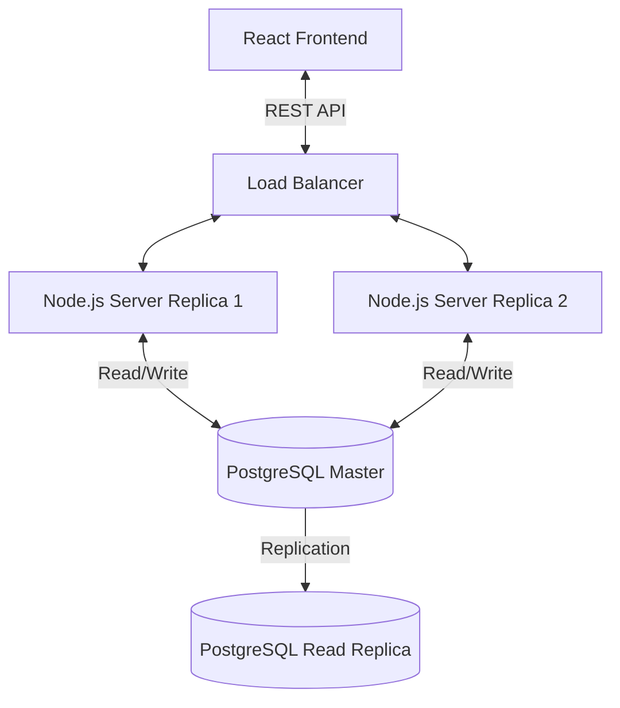

# System Design - DocBook

## High-Level Architecture
DocBook follows a classic **Client-Server Architecture**.

- **Client**: Single Page Application (SPA) built with React. Fetches data via REST APIs.
- **Server**: Stateless Node.js/Express REST API. Handles business logic and DB interactions.
- **Database**: PostgreSQL Relational Database. Stores Doctors, Slots, and User Bookings.

### Diagram


## Database Design & Scaling
### Schema
- `Doctor`: Basic profile.
- `Slot`: Represents a time window. Contains `version` (optimistic lock) or we use row locking. Indexed by `(doctorId, time)`.
- `Booking`: normalized record of a user booking a slot.

### Scaling Strategy
1. **Vertical Scaling**: Increase DB server resources (CPU/RAM).
2. **Read Logic**: Use **Read Replicas** for query-heavy operations (e.g., listing doctors/slots).
3. **Sharding**: If booking volume explodes (millions/day), shard `Bookings` and `Slots` by `doctorId` or `timeRange`.
4. **Connection Pooling**: Use PgBouncer to manage connections from multiple server instances.

## Concurrency Control
To prevent overbooking (race conditions):
We use **Pessimistic Locking** via Database Transactions.

**Workflow**:
1. Start Transaction (`BEGIN`).
2. Select the Slot with `FOR UPDATE`. This locks the row.
   ```sql
   SELECT * FROM "Slot" WHERE id = '...' FOR UPDATE;
   ```
3. Check `isBooked` status.
   - If `true`: Rollback (`ROLLBACK`) and return error.
   - If `false`: Update `isBooked = true`, Create `Booking` record.
4. Commit Transaction (`COMMIT`).

This guarantees atomicity. Even if 100 requests come in, only one acquires the lock; others wait or fail.

## Caching Strategy
- **Redis** for frequently accessed data that changes infrequently:
  - Doctor profiles.
  - Slot availability (with TTL or invalidation on booking).
  - Use "Cache-Aside" pattern.

## Message Queues (Optional decouple)
- Use **RabbitMQ** or **Kafka** for post-booking actions:
  - Sending Email/SMS confirmations.
  - Analytics processing.
  - This ensures the booking API response is fast and purely focused on data integrity.
